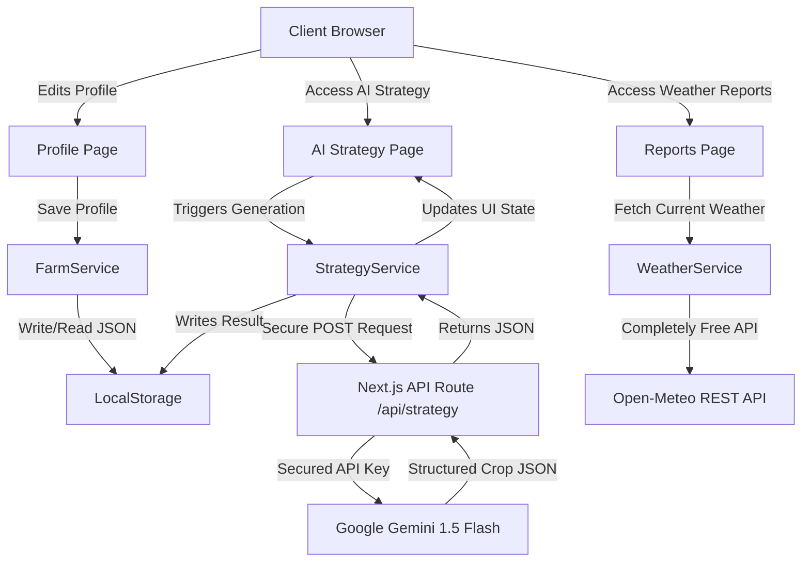

# KrishiSarathi - AI Decision OS for Smart Agriculture 🌾

KrishiSarathi is a Next-generation, high-performance **Agricultural Decision Operating System** built for modern farming. Built using **Next.js 15 (App Router)** and styled with a premium, responsive **Apple/Linear dark mode UI**, it empowers farmers to make data-backed choices about crop strategies, profitability projection, risk modeling, and organic transitions.

## 🚀 Hackathon Features

- **Gemini 1.5 Flash AI Engine**: Secure server-side integration that analyzes the user's Farm Profile (soil health, irrigation, size) and dynamically generates tailored crop strategy JSON recommendations.
- **Open-Meteo Weather Service**: Real-time weather dashboard integration fetching current temperature, rainfall, wind speeds, and precipitation dynamically without any API key.
- **Accessibility Suite (a11y)**: 
  - **Text-to-Speech (TTS)**: Built-in reader that parses and reads out key metrics and reports for visually impaired users.
  - **High Contrast Mode**: Dynamic UI toggle to enhance color contrast instantly.
  - Screen reader-ready semantic HTML markup (`aria-labels`, `roles`).
- **Production-Ready Service Layer**: Pure offline-capable architecture reading/writing to `localStorage` through services, making it extremely easy to swap `localStorage` for a live backend (like Supabase) post-hackathon.

---

## 🗺️ System Architecture



---

## 🛠️ Tech Stack

- **Framework**: [Next.js 15 (App Router)](https://nextjs.org/)
- **Build Engine**: Next.js Turbopack
- **AI Backend**: [Google Gemini 1.5 Flash API](https://ai.google.dev/)
- **Charts & Projections**: [Recharts](https://recharts.org/)
- **Styling**: Tailwind CSS & Lucide Icons
- **Weather Provider**: [Open-Meteo API](https://open-meteo.com/)
- **Data Persistence**: Reusable LocalStorage service wrappers

---

## ⚙️ Setup & Installation

### 1. Prerequisites
Ensure you have [Node.js (v18+)](https://nodejs.org/) installed.

### 2. Install Dependencies
```bash
npm install
```

### 3. Environment Variables
Create a `.env.local` file at the root of the project:
```env
GEMINI_API_KEY=YOUR_GEMINI_API_KEY
```

### 4. Run Development Server
```bash
npm run dev
```
Open [http://localhost:3000](http://localhost:3000) to view the application.

---

## 📂 Project Structure

```
├── src/
│   ├── app/
│   │   ├── api/
│   │   │   └── strategy/             # Server API route calling Gemini
│   │   └── dashboard/                # Main Dashboard routes
│   │       ├── farm/                 # Farm DNA
│   │       ├── organic/              # Organic Roadmap
│   │       ├── planner/              # Profit Planner
│   │       ├── profile/              # Settings & Profile Editor
│   │       ├── reports/              # Reports & Live Weather
│   │       └── strategy/             # AI Strategy Recommendations
│   ├── services/                     # Service abstraction layer (reads/writes local storage)
│   │   ├── farm.service.ts
│   │   ├── strategy.service.ts
│   │   └── weather.service.ts
│   └── lib/
│       └── storage/                  # Safe local storage wrappers & keys
│           ├── storage.ts
│           └── keys.ts
```

---

## ♿ Accessibility Guidelines
The project is built to support all users:
1. **Screen Readers**: Includes semantic `<main>`, `<nav>`, and `<header>` tags with distinct `aria-labels`.
2. **Text-To-Speech Widget**: Easily accessible via the floating sound icon at the bottom right.
3. **Contrast Toggles**: Floats in the bottom-right corner for visual aid.
